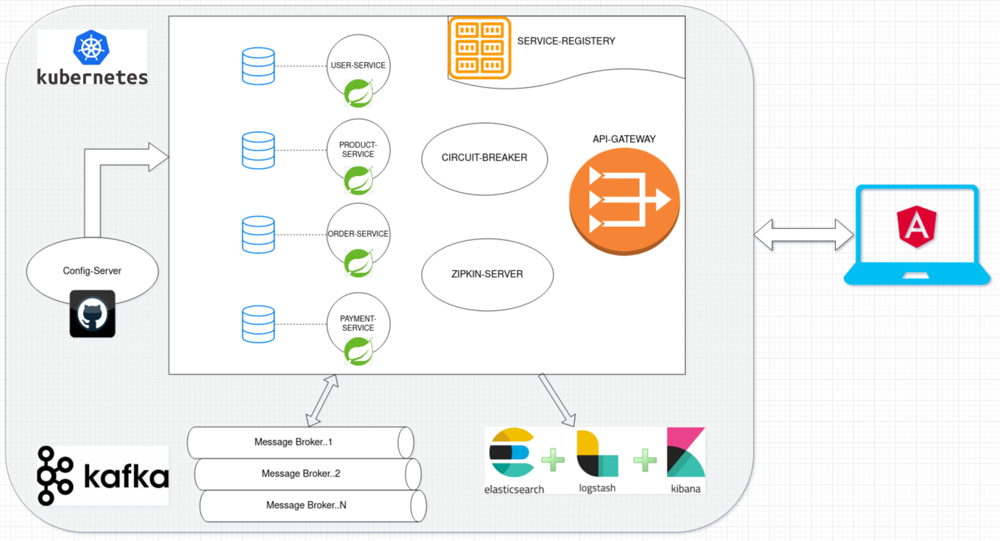

### Required software

The following are the initially required software pieces:

1. **Java 11**: JDK 11 LTS can be downloaded and installed from https://www.oracle.com/java/technologies/javase/jdk11-archive-downloads.html

1. **Git**: it can be downloaded and installed from https://git-scm.com/downloads

1. **Maven**: Apache Maven is a software project management and comprehension tool, it can be downloaded from here https://maven.apache.org/download.cgi

1. **curl**: this command-line tool for testing HTTP-based APIs can be downloaded and installed from https://curl.haxx.se/download.html

1. **jq**: This command-line JSON processor can be downloaded and installed from https://stedolan.github.io/jq/download/

1. **Spring Boot Initializer**: This *Initializer* generates *spring* boot project with just what you need to start quickly! Start from here https://start.spring.io/
   > For each future stage, I will list the newly required software. 
   
## Using an IDE

I recommend that you work with your Java code using an IDE that supports the development of Spring Boot applications such as Spring Tool Suite or IntelliJ IDEA Ultimate Edition. So you can use the Spring Boot Dashboard to run the services, run each microservice test case, and many more.

All that you want to do is just fire up your IDE **->** open or import the parent folder `ecommerce-microservice-backend-app`, and everything will be ready for you.

## Data Model
### Entity-Relationship-Diagram

*Happy Coding ...* 🙂
